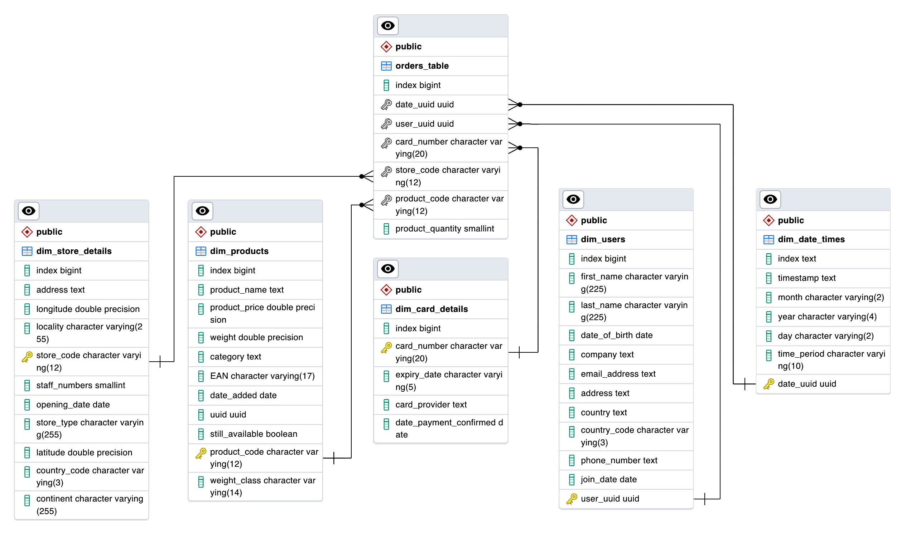

# Retail Data Centralisation

### Overview

As part of a multinational company selling a wide array of goods globally, the current challenge involves scattered sales data across various sources, hindering accessibility and analysis. The project aims to centralize this data, creating a unified, easily analyzable repository. The initial step involves developing a system to consolidate existing company data into a singular database, establishing a single source of truth for sales information. Subsequent phases will focus on querying this database to extract up-to-date business metrics, enhancing data-driven decision-making within the organization.

This project extracts data from the following sources:
- A database stored in AWS RDS
- A PDF stored in an AWS S3 bucket
- A CSV file stored in an AWS S3 bucket
- JSON data stored in an AWS S3 bucket
- JSON data from a REST API

All extracted data is then cleaned using the Pandas library for Python. Once clean, it is imported into a local Postgres database where the data is cast into correct data-types and a star-based schema is developed.

### Dependencies

In order to install all dependencies, run `pip install -r requirements.txt` in the project directory. This will install the following packages:

- boto3
- pandas
- python-dotenv
- Requests
- SQLAlchemy
- tabula_py

*Note: A populated .env file is required for this project to funtion.*

### Project Structure

<pre>
<b>multinational-retail-data-centralisation/</b>
├─ <b>main.py</b>
│  Code orchestrating the processing and cleaning.
├─ <b>database_utils.py</b>
│  Helper functions for interfacing with databases.
├─ <b>data_extraction.py</b>
│  Code used to extract data from sources.
├─ <b>data_cleaning.py</b>
│  Specialised functions for cleaning extracted data.
├─ <b>casts/</b>
│  The SQL queries required to:
│    - Cast data into correct data types.
│    - Set primary keys.
│    - Set foreign key constraints.
├─ <b>tests/</b>
│  SQL queries to test the local database.
├─ <b>db_backups/</b>
│  Backups of the local database during project milestones.
├─ <b>README.md</b>
├─ <b>LICENSE</b>
</pre>

### Local Database Schema

  

### Tests

#### [The average time taken between each sale grouped by year:](tests/time_between_sales.sql)

|year|hours|minutes|seconds  |milliseconds|
|----|-----|-------|---------|------------|
|2013|2    |17     |13.712533|713         |
|1993|2    |15     |35.481806|482         |
|2002|2    |13     |39.915690|916         |
|2008|2    |13     |3.770202 |770         |
|2022|2    |13     |2.003698 |4           |
|1995|2    |13     |0.053404 |53          |
...

#### [Which type of store is generating the most sales in Germany:](tests/sales_by_german_store_type.sql)

|total_sales|store_type|country_code|
|-----------|----------|------------|
|198277.57  |Outlet    |DE          |
|247608.37  |Mall Kiosk|DE          |
|336553.52  |Super Store|DE          |
|1070843.15 |Local     |DE          |

#### [The overall staff numbers in each location around the world:](tests/staff_by_country.sql)

|total_staff_numbers|country_code|
|-------------------|------------|
|12559              |GB          |
|5696               |DE          |
|1282               |US          |

#### [Which months in which years have had the most sales historically:](tests/sales_by_date.sql)

|total_sales|year|month|
|-----------|----|-----|
|27936.77   |1994|3    |
|27356.14   |2019|1    |
|27091.67   |2009|8    |
|26679.98   |1997|11   |
|26310.97   |2018|12   |
|26277.72   |2019|8    |
|26236.67   |2017|9    |
|25798.12   |2010|5    |
|25648.29   |1996|8    |
|25614.54   |2000|1    |

#### [The total and percentage of sales coming from each of the different store types:](tests/sales_by_store.sql)

|store_type|total_sales|percentage_total|
|----------|-----------|----------------|
|Local     |3328735.1699998286|43.12           |
|Web Portal|1725944.749999953|22.36           |
|Super Store|1144460.0999999854|14.83           |
|Mall Kiosk|684963.8099999982|8.87            |
|Outlet    |596767.7099999997|7.73            |

#### [How many products were sold and the amount of sales made for online and offline purchases:](tests/online_sales.sql)

|numbers_of_sales|product_quantity_count|location|
|----------------|----------------------|--------|
|26957           |107739                |Web     |
|93166           |374047                |Offline |
